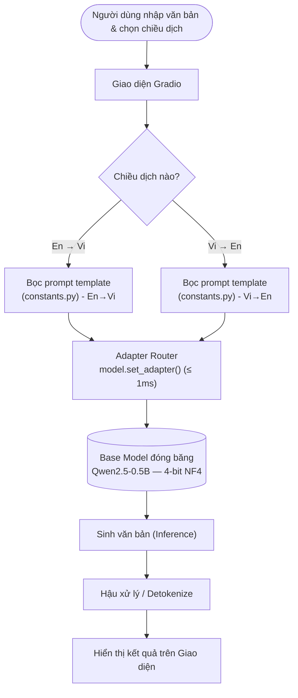
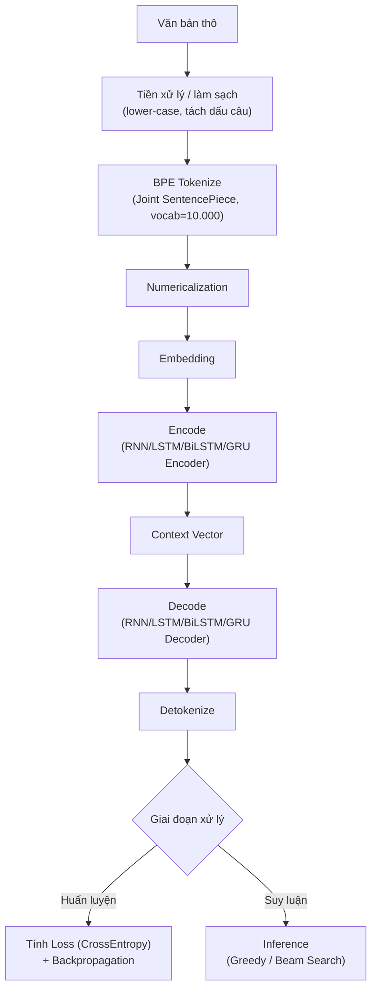

# 🌐 Nghiên cứu & So sánh Kiến trúc Dịch máy Anh ⇄ Việt: Từ Mạng Tuần tự đến LLM Edge-Optimized với QLoRA Multi-Adapter
### *Benchmarking Machine Translation Ecosystems: From Sequential Architectures to Edge-Optimized Multi-Adapter LLMs*

---

## 1. Giới thiệu dự án & Ý nghĩa thực tế

* **Mục tiêu:** Tái hiện hành trình phát triển của ngành Dịch máy (Machine Translation) qua 3 cột mốc: 
  * Mạng tuần tự cổ điển (RNN, LSTM, GRU, BiLSTM).
  * Mạng Attention tự xây dựng (Scratch Transformer).
  * Kỹ thuật Parameter-Efficient Fine-Tuning hiện đại (Qwen2.5-0.5B + 4-bit QLoRA Multi-Adapter).
* **Động lực nghiên cứu:** Hiểu sâu sắc lý do các kiến trúc mới thay thế kiến trúc cũ thông qua thực nghiệm đối chiếu chỉ số (BLEU/TER), thay vì chỉ tiếp cận lý thuyết.
* **Bài toán thực tế giải quyết:** 
  * **Bảo mật tối đa (On-Premise):** Dịch hoàn toàn offline tại local, loại bỏ rủi ro rò rỉ dữ liệu nhạy cảm (Tài chính, Y tế, Pháp lý) khi dùng API đám mây.
  * **Tối ưu chi phí:** Đạt chất lượng dịch tiệm cận thương mại nhưng chỉ yêu cầu tài nguyên siêu nhỏ (~1GB VRAM), vận hành mượt mà trên laptop văn phòng.

---

## 2. Về bộ dữ liệu PhoMT

Dự án sử dụng **PhoMT** — bộ ngữ liệu song ngữ Anh–Việt công khai lớn nhất hiện có cho nghiên cứu dịch máy chất lượng cao.

* **Quy mô dữ liệu:** ~250.000 cặp câu song ngữ đã được căn chỉnh (aligned) và lọc nhiễu kỹ càng.
* **Phân chia tập dữ liệu:** Áp dụng đồng nhất tỉ lệ chuẩn của PhoMT cho toàn bộ các thí nghiệm để đảm bảo tính công bằng:
  * **Train Set:** ~250.000 câu.
  * **Validation Set:** ~19.000 câu.
  * **Test Set:** ~19.000 câu.
* **Tập Test LLM:** Đánh giá độc lập trên một tập test cố định gồm 1.500 câu tách biệt để so sánh các cấu hình QLoRA.

---

## 3. Kiến trúc dự án & Tech Stack

Dự án được thiết kế theo mô hình mô-đun hóa (modular design) giúp dễ dàng deploy và bảo trì:

### 📂 Cấu trúc mã nguồn (Project Structure)

```text
ai-translator-project/
├── base_qwen/            # Thư mục chứa trọng số mô hình nền Qwen2.5-0.5B
├── adapters/             # Thư mục chứa các Adapter song ngữ (en_vi / vi_en)
├── constants.py          # Quản lý tập trung Prompts, Emojis và Nhãn UI
├── style.css             # Thiết kế giao diện Fluent phẳng dạng công cụ tối giản
└── app.py                # File thực thi chính (Động cơ dịch & Gradio Blocks UI)
```

### 🛠️ Chi tiết Công nghệ (Tech Stack)
* **Frontend (Giao diện):** 
  * **Gradio:** Framework xây dựng nhanh giao diện tương tác cho Machine Learning model.
  * **CSS Custom (Fluent Design):** Tách biệt file `style.css` để tối ưu hóa trải nghiệm người dùng, tinh chỉnh giao diện dạng công cụ làm việc gọn gàng.
* **Backend (Xử lý & Suy luận):**
  * **Python:** Ngôn ngữ lập trình chính của dự án.
  * **PyTorch (CUDA-accelerated):** Thư viện nền tảng cho tính toán tensor và huấn luyện mạng nơ-ron.
  * **Hugging Face Transformers:** Load mô hình nền Qwen và tokenizer đi kèm.
  * **PEFT (Parameter-Efficient Fine-Tuning):** Thư viện quản lý, nạp và chuyển đổi nóng các Adapter LoRA động.
  * **BitsAndBytes:** Thực hiện lượng tử hóa (Quantization) mô hình gốc xuống 4-bit (NF4) khi load vào bộ nhớ.

---

## 4. Kiến trúc Hệ thống & Luồng xử lý Dữ liệu (Phần LLM + QLoRA)

Mô hình nền (`Qwen2.5-0.5B`) được đóng băng ở dạng nén 4-bit, các adapter LoRA tương ứng với từng chiều dịch được hoán đổi động theo yêu cầu của người dùng trong thời gian thực.



### ⚙️ Quy trình vận hành:
1. **Khởi tạo local:** Tải trọng số mô hình nền (`base_qwen`), tokenizer và cấu hình adapter trực tiếp lên VRAM.
2. **Định tuyến prompt:** Hệ thống tự động bọc văn bản vào khung prompt tương ứng được định nghĩa tại `constants.py`.
3. **Chuyển mạch adapter:** Cơ chế `.set_adapter()` hoán đổi các ma trận trọng số LoRA tương ứng trong thời gian thực (tốc độ chuyển mạch <= 1ms) mà không cần nạp lại mô hình nền.

---

## 5. Luồng thực nghiệm của 4 mạng tuần tự (RNN / LSTM / BiLSTM / GRU)

Cả 4 kiến trúc tuần tự trong dự án đều đi qua chung một pipeline xử lý dữ liệu và huấn luyện từ đầu. Phần giải mã (Decoder) sử dụng chính các lớp tuần tự tương ứng (không dùng Attention) để đảm bảo tính thuần túy của kiến trúc:



---

## 6. Nhật ký Thực nghiệm & Kết quả Đo đạc

Đo đạc bằng hai thang đo chuẩn quốc tế: **SacreBLEU** (↑, độ tương đồng phân phối n-gram) và **TER** (↓, Translation Error Rate — tỷ lệ lỗi chỉnh sửa).
* **Hạ tầng huấn luyện:** Sử dụng tài nguyên Kaggle GPU free-tier.

### Bảng 1 — Kiến trúc tuần tự (Sequential Models)
*Cấu hình: Embedding Dim = 256, Hidden Dim = 512, Vocab Size = 10.000 (Joint BPE qua SentencePiece).*

| Kiến trúc | Giải mã | SacreBLEU ↑ | TER ↓ | Nhận xét thực nghiệm |
| :--- | :--- | :---: | :---: | :--- |
| **Vanilla RNN** | Beam Search (K=3) | 0.45 | 120.42 | Mất mát thông tin nghiêm trọng với câu dài do hiện tượng tiêu biến Gradient (Vanishing Gradient). |
| | Argmax (Greedy) | 0.28 | 172.44 | Nghẽn bộ nhớ mạng khiến dịch lặp từ vô nghĩa. |
| **LSTM** | Beam Search (K=3) | 2.26 | 106.99 | Cải thiện hơn RNN nhờ cơ chế các cổng (gates), bắt đầu giữ được cấu trúc ngữ pháp ngắn. |
| | Argmax (Greedy) | 1.99 | 111.48 | Vẫn dịch thiếu/sót từ ở các câu có sắc thái phức tạp. |
| **BiLSTM** | Beam Search (K=3) | 4.15 | 106.75 | Cải thiện rõ rệt nhờ quét ngữ cảnh hai chiều (Forward & Backward), tăng kết nối ngữ nghĩa. |
| | Argmax (Greedy) | 3.49 | 114.62 | Vẫn bị giới hạn bởi nút thắt cổ chai của vector ngữ cảnh cố định (Context Vector Bottleneck). |
| **GRU** | Beam Search (K=3) | 4.34 | 103.76 | Kiến trúc tối ưu nhất nhóm tuần tự — ít tham số hơn LSTM, hội tụ nhanh, BLEU cao nhất nhóm. |
| | Argmax (Greedy) | 3.74 | 109.41 | - |

### Bảng 2 — Attention-based (Tự huấn luyện từ đầu - From Scratch)
*Cấu hình: Scratch Transformer (PyTorch, tự cài đặt Encoder-Decoder + Positional Encoding). Siêu tham số: d_model = 512, num_heads = 8, num_layers = 6, d_ff = 2048, Epochs = 35.*

| Kiến trúc | Giải mã | SacreBLEU ↑ | TER ↓ | Nhận xét thực nghiệm |
| :--- | :--- | :---: | :---: | :--- |
| **Scratch Transformer** | Beam Search (K=3) | **10.49** | **76.29** | Bước nhảy vọt về chất — Cơ chế Multi-Head Self-Attention loại bỏ hoàn toàn tính tuần tự, liên kết xuất sắc các token ở khoảng cách xa. BLEU gấp ~2.5 lần GRU. |
| | Argmax (Greedy) | 10.39 | 77.08 | - |

### Bảng 3 — LLM + QLoRA Multi-Adapter (Fine-tuning kết hợp Đông cứng)
*Cấu hình nền: Qwen2.5-0.5B, đóng băng ở 4-bit (NF4). Đánh giá offline trên tập test cố định 1.500 câu.*

| Cấu hình LoRA (Rank/Alpha) | Dữ liệu Train | Chiều dịch | Siêu tham số | SacreBLEU ↑ | TER ↓ | Ghi chú kỹ thuật |
| :--- | :--- | :---: | :--- | :---: | :---: | :--- |
| **Gốc (Zero-shot)** | Không train | En→Vi<br/>Vi→En | N/A | 5.89<br/>14.91 | 88.33<br/>75.09 | Sinh từ mất kiểm soát do chưa được định hướng (align) với tập song ngữ đặc thù của miền dữ liệu. |
| **LoRA r=16, a=32** | 800 câu | En→Vi<br/>Vi→En | Step=400, BS=2 | 14.50<br/>14.48 | 71.10<br/>78.86 | Chỉ với 800 câu (quick demo), việc cập nhật trọng số ma trận chiếu Attention đã giúp mô hình vượt qua Scratch Transformer. |
| **LoRA r=8, a=16** | 800 câu | En→Vi<br/>Vi→En | Step=400, BS=2 | 13.50<br/>14.02 | 77.05<br/>71.75 | Hạ rank xuống 8 thu hẹp không gian tham số cập nhật, gây suy giảm nhẹ chỉ số BLEU. |
| **LoRA r=8, a=16 (Lần 2)**| 5.000 câu | En→Vi<br/>Vi→En | Epoch=3, BS=4 | 16.22<br/>15.47 | 69.43<br/>79.18 | Tăng dữ liệu lên 5k câu cải thiện rõ rệt — Lượng dữ liệu lớn đã bù đắp được giới hạn của rank thấp. |
| **LoRA r=32, a=64** | 15.000 câu | En→Vi<br/>Vi→En | Epoch=3, BS=1 | **18.41**<br/>**16.88** | **66.88**<br/>**71.87** | **Cấu hình tối ưu nhất** — Rank 32 kết hợp dữ liệu lớn giúp mô hình đạt độ chín về văn phong, dịch tự nhiên, chuẩn bản địa và làm chủ cấu trúc đảo ngữ phức tạp. |

---

## 7. Cấu hình triển khai thực tế & Tốc độ dịch (Inference Benchmarks)

*(Mục này dùng để điền các thông số thực tế khi chạy dự án tại máy cá nhân/môi trường deploy)*

### 💻 Cấu hình phần cứng chạy thử nghiệm (Hardware Specs)
* **CPU:** `[...]`
* **RAM:** `[...]`
* **GPU (nếu có):** `[...]`
* **Dung lượng VRAM tiêu thụ thực tế:** `[...]`

### ⚡ Tốc độ dịch thực tế (Inference Latency & Speed)
* **Thời gian dịch trung bình (Latency):** `[...]` giây/câu.
* **Tốc độ sinh từ (Throughput):** `[...]` tokens/giây.

---

## 8. Lập luận Kỹ thuật & Rút ra từ Thực nghiệm

* **Nút thắt của mạng Recurrent:** Mạng tuần tự gặp hiện tượng "thắt nút cổ chai" (Context Vector Bottleneck) khi cố nén thông tin câu dài vào một vector kích thước cố định, gây mất mát thông tin ngữ cảnh lớn.
* **Sức mạnh của Self-Attention:** Scratch Transformer phá vỡ giới hạn tuần tự, cho phép liên kết trực tiếp giữa các từ bất kể khoảng cách địa lý trong câu (BLEU tăng vọt gấp 2.5 lần so với GRU).
* **Hiệu quả kinh tế của QLoRA Multi-Adapter:** 
  * Giảm VRAM tối đa (~1GB) nhờ kỹ thuật lượng tử hóa 4-bit mô hình gốc và gộp các adapter LoRA siêu nhẹ.
  * Loại bỏ hiện tượng quên thảm họa (catastrophic forgetting) bằng cách đóng băng toàn bộ tham số của mô hình nền.

---

## 9. Hướng dẫn Triển khai Giao diện (Local Run)

Để khởi chạy giao diện dịch thuật Gradio trực tiếp tại máy cục bộ:

```bash
# 1. Di chuyển vào thư mục dự án
D:
cd D:\DA_CaNhan\ai-translator-project

# 2. Khởi chạy ứng dụng bằng Python của môi trường ảo local
D:\C\anaconda3\envs\ai_gradio\python.exe app.py
```

Sau khi khởi chạy, mở trình duyệt và truy cập: `[http://127.0.0.1:7860](http://127.0.0.1:7860)` để trải nghiệm giao diện.

---

## 10. Giới hạn & Định hướng phát triển

* **Tài nguyên huấn luyện mạng cũ:** Điểm BLEU của các mạng tuần tự và Scratch Transformer còn thấp do giới hạn tài nguyên tính toán miễn phí (Kaggle free-tier giới hạn thời gian chạy), chưa phản ánh giới hạn tối đa của kiến trúc nếu được tối ưu thêm.
* **Độ rộng miền dữ liệu:** Tập test 1.500 câu dùng để đánh giá nội bộ giữa các cấu hình, chưa bao phủ hết các thuật ngữ phức tạp thuộc chuyên ngành sâu (Y khoa, Luật quốc tế).
* **Hướng phát triển:** 
  * Mở rộng thêm các Adapter cho các ngôn ngữ khác (Trung-Việt, Nhật-Việt).
  * Thử nghiệm nâng Rank/Alpha với lượng dữ liệu lớn hơn.
  * Đóng gói toàn bộ ứng dụng thành file chạy Offline Installer (.exe) tự động setup không cần cài đặt môi trường code phức tạp cho người dùng cuối.
```
